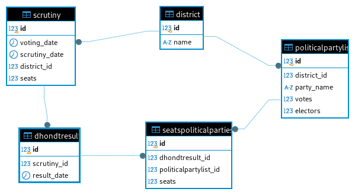

# D'hondt Calculation System 

D'hondt Calculation System for allocating seats in parliaments among federal states, or in proportional representation among political parties.
For more information please [read the article](https://en.wikipedia.org/wiki/D%27Hondt_method).


## Projects Components


### Web server and API

This project was developed based on Python [Flask](https://flask.palletsprojects.com/en/stable/) web application framework for API and web server.

In addition to Flask, [Marsmallow](https://flask-marshmallow.readthedocs.io/en/latest/) (an object serialization/deserialization library) is used to validate both received parameters and answers.

Flask is running in a single service using docker container.


### Database

The project use OR [PosgreSQL](https://www.postgresql.org/) as **RDBMS**. 

The project use [SQLAlchemy](https://www.sqlalchemy.org/) as Python SQL Toolkit and Object Relational Mapper (ORM) along with [Alembic](https://alembic.sqlalchemy.org/en/latest/) as migration tool. 


## API Definition

The project provides the OpenAPI specification file (src/web/dhondt.yaml) where the API is described.

To see the specification click in the following link [API Specification](https://petstore.swagger.io/?url=https://raw.githubusercontent.com/est3bf/dhondt/refs/heads/master/src/web/dhondt.yaml?token=GHSAT0AAAAAAC3SFHDDVOPFO6HP256FPQNKZ2XWQ6A) 


## Database Schema Definition


<p align="center">
  
  <br/>
</p>


## How to build and run containers

We build the repo images using docker compose.


1. Get docker running.
    **Note:** do not forget to add your user to docker group:
    ```
    $ sudo adduser youruser docker
    ```
2. Build the image:
   1. For production:
        ```
        $ docker compose -f .gci/docker-compose.yml  -p [project name] build dhondt
        ```
        [project name] is the project name which the image and container will have.
        For example:
        ```
        $ docker compose -f .gci/docker-compose.yml  -p msa_dhondt build dhondt
        ```
    2. For debug:
        ```
        $ docker compose -f .gci/docker-compose.yml  -f .gci/docker-compose-dev.yml -p [project name] build dhondt
        ```
        [project name] is the project name which the image and container will have.
        For example:
        ```
        $ docker compose -f .gci/docker-compose.yml  -f .gci/docker-compose-dev.yml -p msa_dhondt build dhondt
        ```
3. Run containers:
    ```
    $ docker compose -f .gci/docker-compose.yml  -p [project name] up -d 
    ```
    [project name] is the project name which the image and container will have.
    For example:
    ```
    $ docker compose -f .gci/docker-compose.yml  -p msa_dhondt up -d 
    ```
4. Stop containers
    ```
    $ docker compose -f .gci/docker-compose.yml  -p [project name] down 
    ```
    [project name] is the project name which the image and container will have.
    For example:
    ```
    $ docker compose -f .gci/docker-compose.yml  -p msa_dhondt down
    ```

